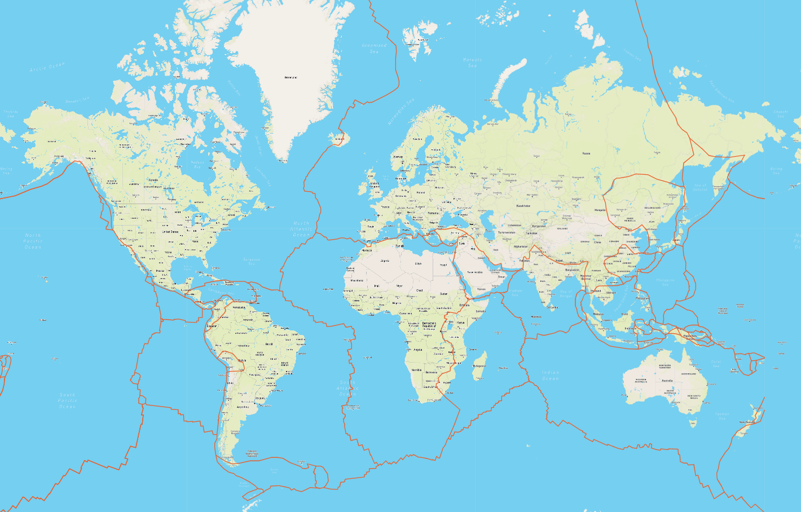
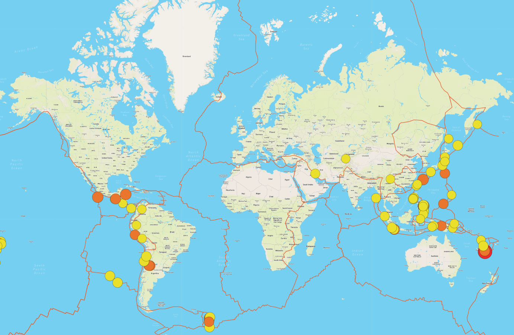
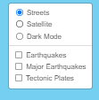
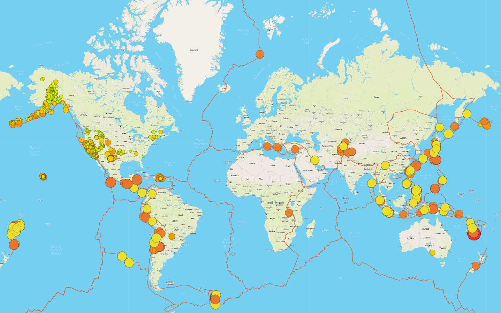

# Mapping_Earthquakes
Creating a visualization platform to map earthquakes and really shake up how they can be visualized on a map.

# Purpose
The purpose of this challenge was to take the earthquake data in relation to the tectonic plates’ location on a map of earth, and to visualize all the earthquakes with a magnitude greater than 4.5 on the map, and an additional third map was provided for user customization. This analysis was used through coding in JavaScript, Leaflet.js, and geoJSON data. The tectonic plate data was added using d3.json() and the geoJSON() layer. The tectonic plate data was set using LineString data to stand out on the map, and the tectonic plate data was overlayed as an object with the earthquake data. The same appraoch was used for adding major earthquake data to the map that can also be toggled on or off. 

# Results

The following are the images of the final website and the visualization of the data.

## Tectonic Plates

The following code reads the geospatial information of the tectonic plates, and then maps them on a linear plot with a geographical map on the background. 

## Major Earthquakes

The following code reads the json data for the major earthquakes for which the magnitude is greater than equal to 4.5. The size of the radius is sized relative to the magnitude and set to the epicenter for which the earthquake occurred. 

## Earthquakes

The original tool was also provided where all the earthquakes can be visualized. This can be found on the same tile layer in the right hand corner.

